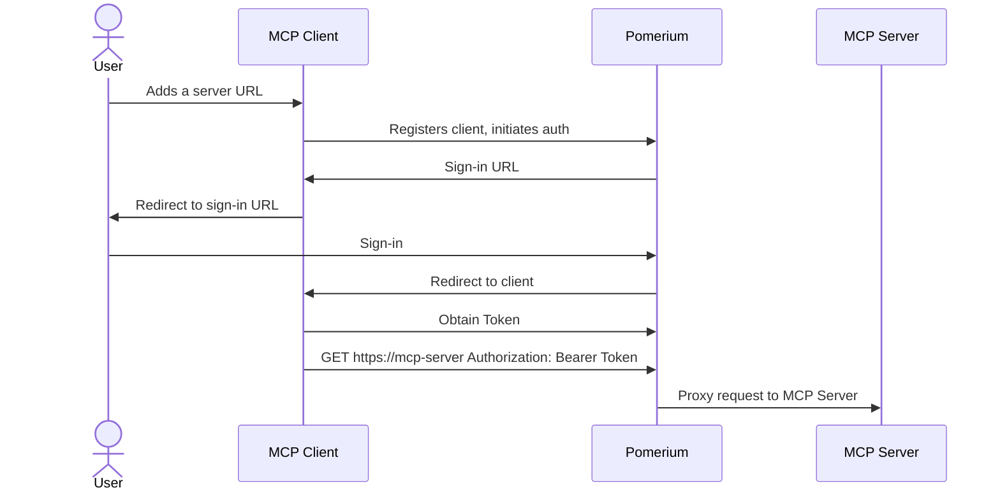
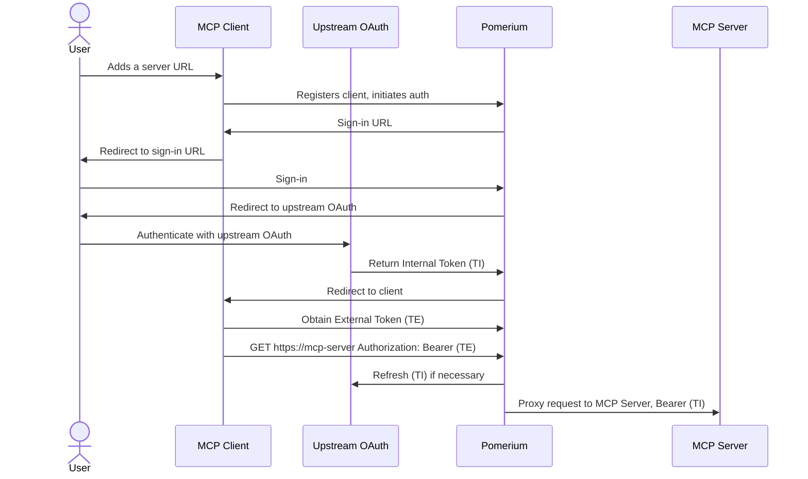
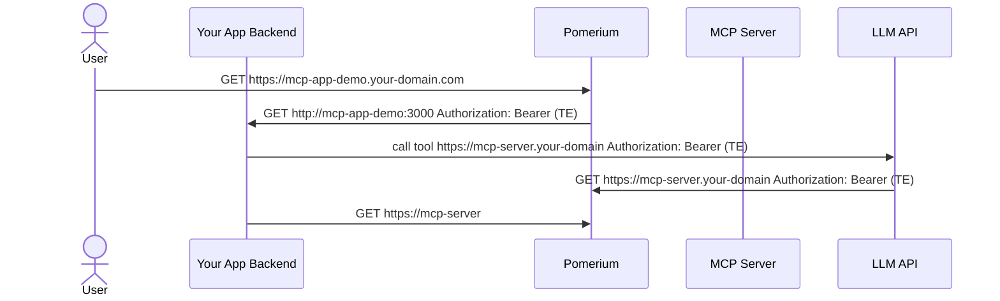

Welcome to the Pomerium Chat, a minimal chat application for showcasing remote Model Context Protocol servers secured with [Pomerium](https://pomerium.com).

# Quick start

## Pre-requisites

1. Linux or MacOS host
2. Docker and Docker Compose
3. Your machine should have port 443 exposed to the internet so that it could acquire TLS certificates from LetsEncrypt and OpenAI could call your MCP server endpoints.
4. OpenAI API Key

## Quickstart

### Environment Variables

Create a `.env` file in the root directory and add the following environment variables:

```bash
OPENAI_API_KEY=your_api_key_here
```

### Pomerium Config

Update [`pomerium-config.yaml`](./pomerium-config.yaml) and replace **YOUR-DOMAIN** with the subdomain you control. Create A DNS records for relevant hosts (or **`*.YOUR-DOMAIN`**).

By default, the access policy limits access to users with emails in **YOUR-DOMAIN**. See [policy language reference](https://www.pomerium.com/docs/internals/ppl) if you need to adjust it.

### Docker Compose

See [`docker-compose.yaml`](./docker-compose.yaml) file in this repo.

```bash
docker compose up -d
```

### Testing

Now you should be able to navigate to `https://mcp-app-demo.YOUR-DOMAIN/`.
A sign-in page would open. After you signed in, you should be redirected to the application itself.

There should be a demo database server (Northwind DB) acessible and in Connected status. Click on it to use it in the conversation.

Now you may ask some questions like "What were our sales by year", and see how OpenAI large language model inference would interact with the MCP database server running on your computer to obtain the answers.

# How does it work

## Token Vocabulary

- **External Token (TE):**  
  An externally-facing token issued by Pomerium that represents the user's session. This token is used by external clients (such as Claude.ai, OpenAI, or your own apps) to authenticate requests to Pomerium-protected MCP servers.  
  Example: The token you provide to an LLM API or agentic framework to allow it to call your MCP server.

- **Internal Token (TI):**  
  An internal authentication token that Pomerium obtains from an upstream OAuth2 provider (such as Notion, Google Drive, GitHub, etc.) on behalf of the user. This token is never exposed to external clients. Pomerium uses this token to authenticate requests to the upstream service when proxying requests to your MCP server.

Pomerium acts as a secure gateway between Model Context Protocol (MCP) clients and servers. It provides authentication and authorization for local HTTP MCP servers, using OAuth 2.1 flows. This setup is especially useful when your MCP server needs to access upstream APIs that require OAuth tokens (such as Notion, Google Drive, GitHub, etc.).

It also enables you to build internal applications that use agentic frameworks or LLM APIs capable of invoking MCP servers, as demonstrated in this repository.

To understand this setup, let's look at how an MCP client communicates with MCP servers that are protected by Pomerium.

## 1. Exposing an Internal MCP Server to a Remote Client

Suppose you want to allow an external MCP client (like Claude.ai) to access your internal MCP server, but you want to keep it secure. Pomerium sits in front of your server and manages authentication and authorization for all incoming requests.

This means you can safely share access to internal resources (like a database) with external clients, without exposing them directly to the internet.

You configure your Pomerium Route as usual with an additional `mcp` property that signifies that this route represents a Model Context Protocol server route.

```yaml
routes:
  - from: https://my-mcp-server.your-domain.com
    to: http://my-mcp-server.int:8080/mcp
    name: My MCP Server
    mcp: {}
```



## 2. MCP Server Needs Upstream OAuth

If your MCP server needs to access an upstream service that requires OAuth (for example, GitHub or Google Drive), Pomerium can handle the OAuth flow for you. Here’s how the process works:

1. The user adds the MCP server URL in the client (e.g., Claude.ai).
2. The client registers with Pomerium and starts authentication.
3. Pomerium gives the client a sign-in URL, which is shown to the user.
4. The user signs in to Pomerium, then is redirected to the upstream OAuth provider.
5. The user authenticates with the upstream provider. The provider returns an **Internal Token (TI)** to Pomerium.
6. Pomerium finishes the sign-in and redirects the user back to the client.
7. The client receives an **External Token (TE)** from Pomerium.
8. The client uses **TE** to make requests to the MCP server.
9. Pomerium refreshes the upstream token (**TI**) as needed and proxies requests to the MCP server, passing **TI** in the `Authorization` header.

**Key benefits:**

- External clients (like Claude.ai) never see your upstream OAuth tokens.
- Your MCP server always receives a valid upstream token.
- The MCP server can remain stateless and does not need to manage OAuth flows or tokens.

**Route configuration:**

```yaml
routes:
  - from: https://github.your-domain
    to: http://github-mcp.int:8080/mcp
    name: GitHub
    mcp:
      upstream_oauth2:
        client_id: xxxxxxxxxxxx
        client_secret: yyyyyyyyy
        scopes: ['read:user', 'user:email']
        endpoint:
          auth_url: 'https://github.com/login/oauth/authorize'
          token_url: 'https://github.com/login/oauth/access_token'
```



### 3. Calling internal MCP server from your app

Some inference APIs, such as the [OpenAI API](https://platform.openai.com/docs/guides/tools-remote-mcp) and [Claude API](https://docs.anthropic.com/en/docs/agents-and-tools/mcp-connector), now support direct invocation of MCP servers. This trend is expected to grow, and many agentic frameworks are adding support for MCP server calls. You can also implement MCP tool calls manually in your app using LLM function calling capabilities. All these approaches require providing an `Authorization: Bearer` **External Token (TE)** for the MCP server so that requests can be securely routed through Pomerium.

If you are building your own internal application and need to obtain such a token, Pomerium offers a _client MCP mode_ for routes. By setting the `mcp.pass_upstream_access_token` option, Pomerium will supply your upstream application with an `Authorization: Bearer` **External Token (TE)** representing the current user session. You can then pass this token to external LLMs or agentic frameworks, allowing them to access MCP servers behind Pomerium according to your authorization policy.

The following flow illustrates this process, assuming the user is already authenticated with Pomerium:



Example route configuration:

```yaml
routes:
  - from: https://mcp-app-demo.your-domain.com
    to: http://mcp-app-demo:3000
    mcp:
      pass_upstream_access_token: true
    policy: {} # define your policy here
  - from: https://mcp-server.your-domain.com
    to: http://mcp-server.int:8080/mcp
    name: My MCP Server
    mcp: {}
    policy: {} # define your policy here
```

# Development

To run this application in development mode:

```bash
npm install
npm run dev
```

This will start the development server with hot reloading enabled.

### Production

To build and run this application for production:

```bash
npm run build
npm run start
```

## Features

- AI-powered chat interface using OpenAI
- Modern UI components with shadcn/ui
- Type-safe routing with TanStack Router
- Data fetching with TanStack Query

## Testing

This project uses [Vitest](https://vitest.dev/) for testing. You can run the tests with:

```bash
npm run test
```

## Styling

This project uses [Tailwind CSS](https://tailwindcss.com/) for styling and [shadcn/ui](https://ui.shadcn.com/) for pre-built components. The UI components are built on top of Radix UI primitives.

### Adding New Components

Add new shadcn components using:

```bash
npx shadcn@latest add [component-name]
```

## Linting & Formatting

This project uses [eslint](https://eslint.org/) and [prettier](https://prettier.io/) for linting and formatting. Eslint is configured using [tanstack/eslint-config](https://tanstack.com/config/latest/docs/eslint). The following scripts are available:

```bash
npm run lint
npm run format
npm run check
```

## Shadcn

Add components using the latest version of [Shadcn](https://ui.shadcn.com/).

```bash
pnpx shadcn@latest add button
```

## Routing

This project uses [TanStack Router](https://tanstack.com/router). The initial setup is a file based router. Which means that the routes are managed as files in `src/routes`.
