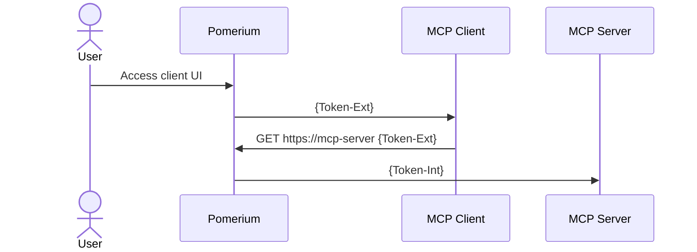

Welcome to the Pomerium Chat, a minimal chat application for showcasing remote Model Context Protocol servers secured with [Pomerium](https://pomerium.com).

# Quick start

## Pre-requisites

1. Linux or MacOS host
2. Docker and Docker Compose
3. Your machine should have port 443 exposed to the internet so that it could acquire TLS certificates from LetsEncrypt and OpenAI could call your MCP server endpoints.
4. OpenAI API Key

## Quickstart

### Environment Variables

Create a `.env` file in the root directory and add the following environment variables:

```bash
OPENAI_API_KEY=your_api_key_here
```

### Pomerium Config

Update `pomerium-config.yaml` and replace **YOUR-DOMAIN** with the subdomain you control. Create A DNS records for relevant hosts (or **`*.YOUR-DOMAIN`**).

By default, the access policy limits access to users with emails in **YOUR-DOMAIN**. See [policy language reference](https://www.pomerium.com/docs/internals/ppl) if you need to adjust it.

### Docker Compose

See `docker-compose.yaml` file in this repo.

```bash
docker compose up -d
```

### Testing

Now you should be able to navigate to `https://mcp-app-demo.YOUR-DOMAIN/`.
A sign-in page would open. After you signed in, you should be redirected to the application itself.

There should be a demo database server (Northwind DB) acessible and in Connected status. Click on it to use it in the conversation.

Now you may ask some questions like "What were our sales by year", and see how OpenAI large language model inference would interact with the MCP database server running on your computer to obtain the answers.

# How does it work

### When a remote MCP Client wants to access your MCP server behind Pomerium

In this scenario, the interaction only happens between remote MCP Client (i.e. Claude.ai), Pomerium, and your MCP server that is secured by Pomerium.



# Development

To run this application in development mode:

```bash
npm install
npm run dev
```

This will start the development server with hot reloading enabled.

### Production

To build and run this application for production:

```bash
npm run build
npm run start
```

## Features

- AI-powered chat interface using OpenAI
- Modern UI components with shadcn/ui
- Type-safe routing with TanStack Router
- Data fetching with TanStack Query

## Testing

This project uses [Vitest](https://vitest.dev/) for testing. You can run the tests with:

```bash
npm run test
```

## Styling

This project uses [Tailwind CSS](https://tailwindcss.com/) for styling and [shadcn/ui](https://ui.shadcn.com/) for pre-built components. The UI components are built on top of Radix UI primitives.

### Adding New Components

Add new shadcn components using:

```bash
npx shadcn@latest add [component-name]
```

## Linting & Formatting

This project uses [eslint](https://eslint.org/) and [prettier](https://prettier.io/) for linting and formatting. Eslint is configured using [tanstack/eslint-config](https://tanstack.com/config/latest/docs/eslint). The following scripts are available:

```bash
npm run lint
npm run format
npm run check
```

## Shadcn

Add components using the latest version of [Shadcn](https://ui.shadcn.com/).

```bash
pnpx shadcn@latest add button
```

## Routing

This project uses [TanStack Router](https://tanstack.com/router). The initial setup is a file based router. Which means that the routes are managed as files in `src/routes`.
